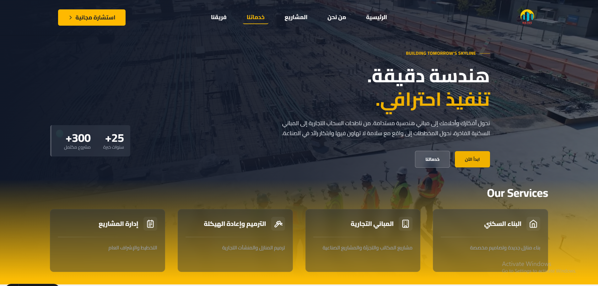

# 🏗 Modern Construction Company Website

A production-ready, bilingual construction company website built with **Astro**, featuring secure quote submission, transactional email automation, and professional UI/UX design.

---

## 🚀 Live Demo

> 

---

## 📸 Preview



---

## ✨ Features

### 🧾 Quote Request System

* Multi-step form
* Server-side validation
* Resend email integration
* Auto-reply confirmation email
* Professional HTML email template

### 🔐 Security & Anti-Spam

* Honeypot field
* Rate limiting (IP-based)
* reCAPTCHA v3 integration (feuture)
* Input sanitization
* Server-side email handling

### 🌍 Internationalization

* English / Arabic support
* Direction-aware layout (LTR / RTL)
* Centralized translation file

### 🎨 Modern UI

* TailwindCSS v4
* DaisyUI components
* Toast notifications
* Loading states & spinners
* View Transitions
* Scroll animations (AOS)
* GSAP animations

---

## 🛠 Tech Stack

| Layer           | Technology            |
| --------------- | --------------------- |
| Framework       | Astro                 |
| UI              | React                 |
| Styling         | TailwindCSS + DaisyUI |
| Email           | Resend                |
| Email Templates | React Email           |
| Animations      | GSAP + AOS            |
| Deployment      | Node Adapter / Vercel |

---

## 🧱 Architecture Overview

### Client → Server → Email Flow

```
User Form
   ↓
Client Validation
   ↓
POST /api/send-quote
   ↓
Server Validation
   ↓
Rate Limiting
   ↓
Honeypot Check
   ↓
Resend API
   ↓
Company Email + Auto Reply
```

---

## 📂 Project Structure

```
src/
 ├── components/
 │   ├── ui/
 │   ├── form/
 │   └── layout/
 │
 ├── pages/
 │   ├── index.astro
 │   └── api/
 │       └── send-quote.ts
 │
 ├── emails/
 │   ├── QuoteEmail.tsx
 │   └── AutoReply.tsx
 │
 │
 ├── i18n/
 │   └── ui.ts
 │
 └── styles/
```

---

## 📧 Email System

### 1️⃣ Admin Notification

* Sent to company email
* Structured HTML layout
* Clean formatting
* Customer details clearly separated

### 2️⃣ Auto Reply

* Sent to customer
* Confirms receipt
* Professional branding

Built using:

* React Email
* Resend API

---

## 🔒 Security Implementation

### Honeypot

Hidden input field:

* If filled → request rejected

### Rate Limiting

IP-based limiting:

* Prevents spam flooding
* In-memory Map or Upstash (recommended for production)

### reCAPTCHA v3

* Token sent with form
* Verified server-side
* Score-based filtering

---

## ⚙️ Environment Variables

Create `.env` file:

```
RESEND_API_KEY=your_key_here
RECAPTCHA_SECRET_KEY=your_secret_here
```

---

## 🧪 Local Development

### Install Dependencies

```
npm install
```

### Run Development Server

```
npm run dev
```

### Build

```
npm run build
```

### Preview Production Build

```
npm run preview
```

---

## 📦 Deployment

Recommended:

* Vercel (Node adapter)
* Railway
* Render

Make sure:

* SSR is enabled
* Environment variables are set

---

## 📊 Performance Considerations

* Partial hydration with Astro
* Minimal JS shipped to client
* Lazy-loaded components
* Optimized images

---

## 🧠 Design Decisions

* SSR for secure API routes
* Server-side email sending (never expose API keys)
* Structured email templates (React Email over raw HTML)
* Modular architecture for scalability

---

## 🔮 Future Improvements

* Dashboard to view quotes
* Database storage
* Admin authentication
* Analytics integration
* Upstash Redis for distributed rate limiting

---

## 👤 Author

Marawan
Computer Science Student
Frontend / Full-Stack Developer

---

## 📜 License

MIT


